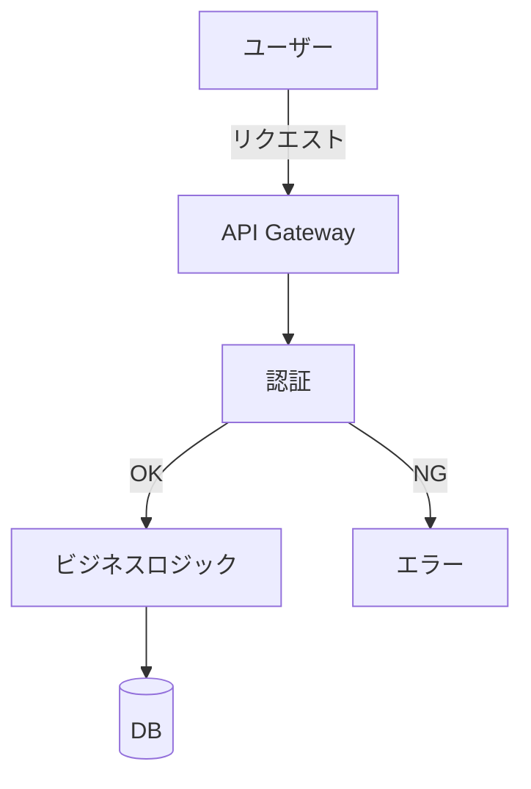

# mermaid スキル

Mermaid 記法で図を生成し、ファイル保存 + プレビューを行う。

## 手順

### 1. 図の種類を判断する

| 図の種類 | Mermaid キーワード |
|---|---|
| フローチャート | `flowchart TD` / `flowchart LR` |
| シーケンス図 | `sequenceDiagram` |
| ER 図 | `erDiagram` |
| クラス図 | `classDiagram` |
| ガントチャート | `gantt` |
| 状態遷移図 | `stateDiagram-v2` |
| マインドマップ | `mindmap` |
| Git グラフ | `gitGraph` |

### 2. Mermaid コードを生成してコードブロックで表示する

必ず ` ```mermaid ` コードブロックで出力すること（Claude Code の IDE 拡張でレンダリングされる）。

### 3. ファイルに保存する

保存先はプロジェクトが存在する場合は `.claude/diagrams/`、なければ `~/diagrams/` に保存する。

```bash
mkdir -p <保存先>
cat > <保存先>/<名前>.md << 'EOF'
# <図のタイトル>

```mermaid
<生成したコード>
```
EOF
```

### 4. ブラウザでプレビューする（任意）

ユーザーが「ブラウザで見たい」「プレビューして」と言った場合のみ実行する。

```bash
# mermaid.live でプレビュー（コードをBase64エンコードしてURLに埋め込む）
python3 -c "
import base64, json, sys
code = sys.stdin.read()
payload = json.dumps({'code': code, 'mermaid': {'theme': 'default'}})
encoded = base64.urlsafe_b64encode(payload.encode()).decode().rstrip('=')
print(f'https://mermaid.live/edit#base64:{encoded}')
" <<< '<mermaidコード>' | xargs open
```

## 出力例



## 注意

- コードブロックは必ず表示する（ターミナルでもテキストとして確認できるため）
- `mmdc`（mermaid-cli）がインストールされている場合は PNG/SVG 生成も可能: `mmdc -i input.md -o output.png`
- ファイル名はスネークケース（例: `auth_flow.md`）
